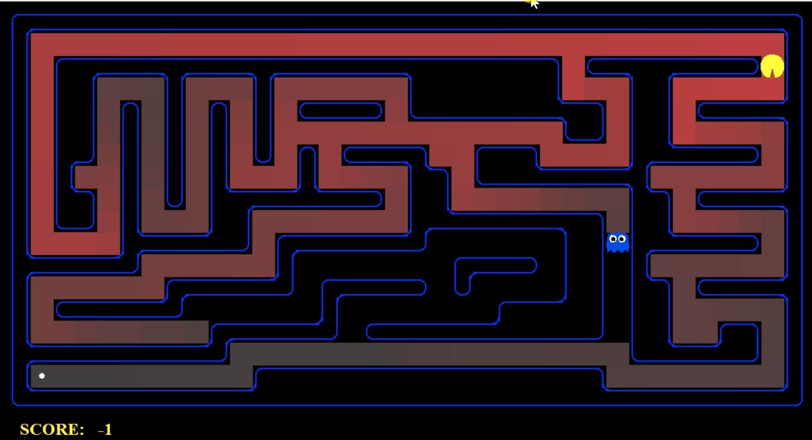
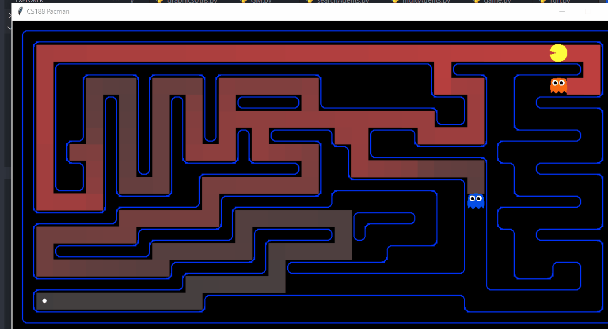
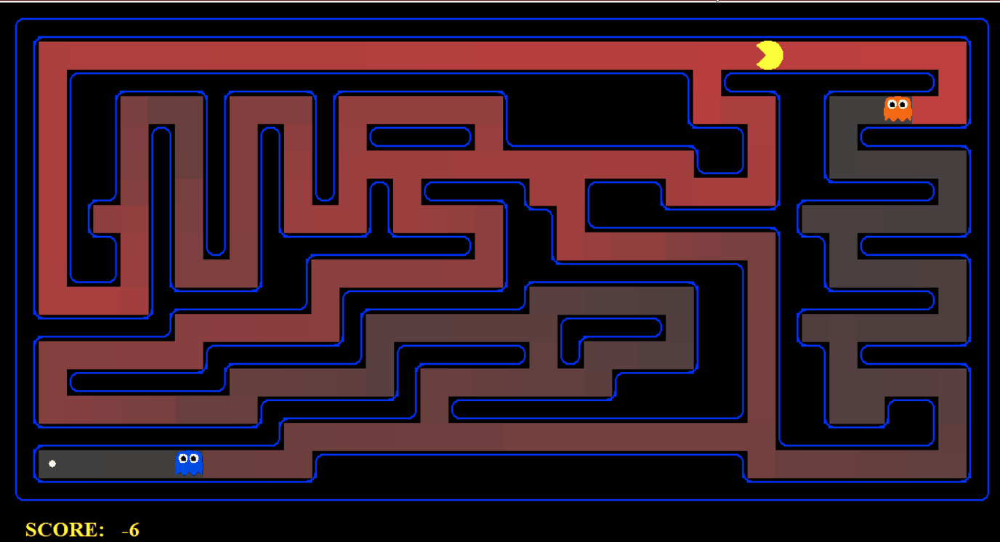
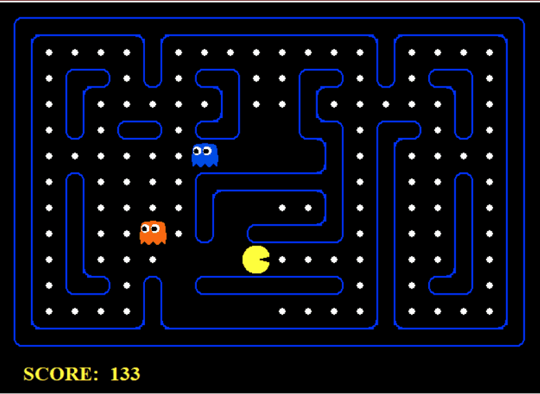
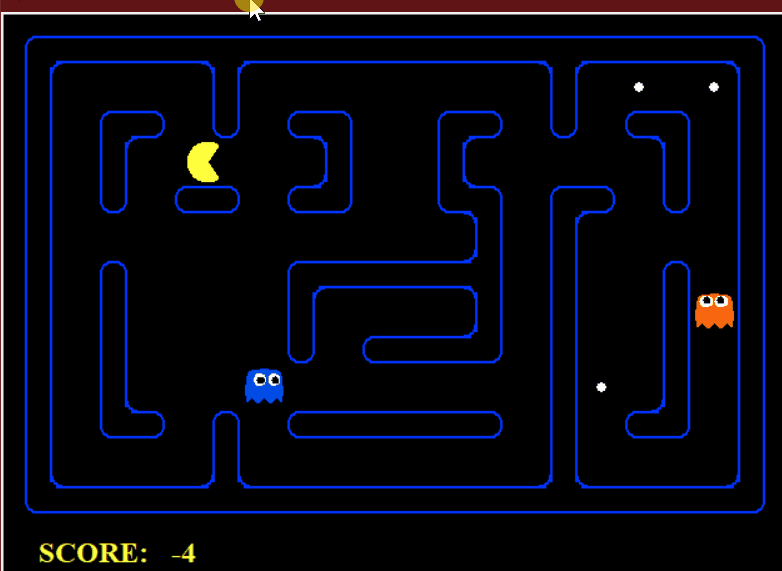
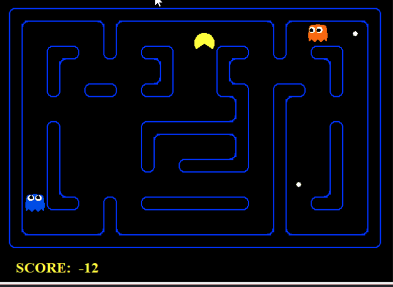
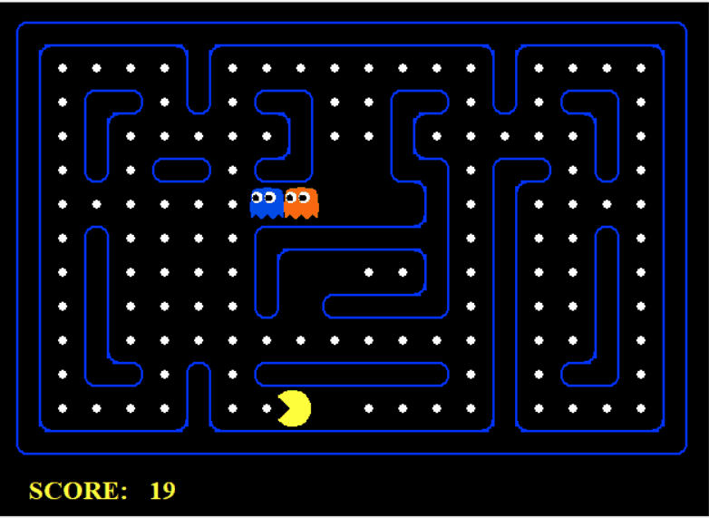
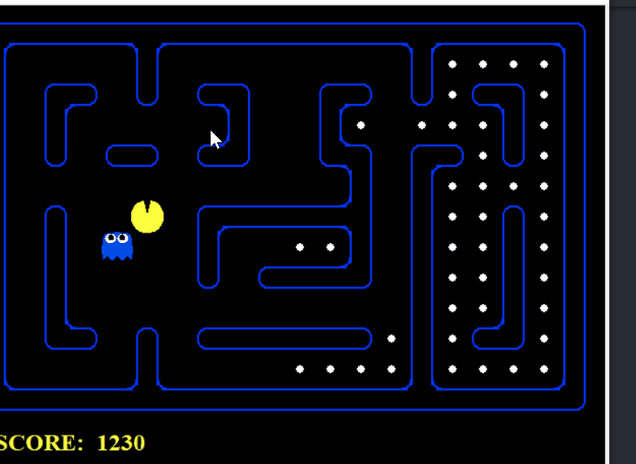
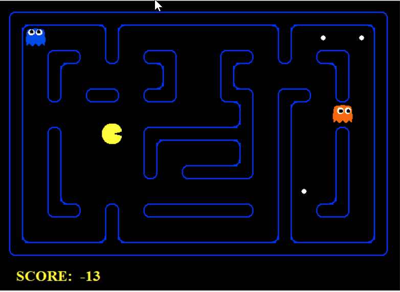

# Demo Project 01 - Search

## Level 1: Search Agent

### BFS:


**Result**: 

```
[SearchAgent] using function bfs
[SearchAgent] using problem type PositionSearchProblem
Path found with total cost of 68 in 0.052859 seconds
Search nodes expanded: 269
Pacman emerges victorious! Score: -48
Scores:        452.0
RESULT:        Win

```

Comment: 

- BFS is easy to implement and easy to use and it also yields a good result.
- However, too many nodes are explored to find the path. 

### DFS


Result: 

```
[SearchAgent] using function dfs
[SearchAgent] using problem type PositionSearchProblem
Path found with total cost of 130 in 0.032008 seconds
Search nodes expanded: 146
Pacman emerges victorious! Score: -110
Scores:        390.0
RESULT:        Win
```

Comments:

- BFS and DFS results in different paths because of their characteristics

### UCS path cost = 1 for every nodes


Result:

```[SearchAgent] using function ucs
[SearchAgent] using function ucs
[SearchAgent] using problem type PositionSearchProblem
-----
Path found with total cost of 68 in 0.077427 seconds
Search nodes expanded: 269
Pacman emerges victorious! Score: -48
Scores:        452.0
RESULT:        Win
```

Comment: 

- UCS 's result yields the better score for the search. Hence the search lead to an optimal result.
- However, it expands too many nodes.

### A*:


Result:

```-----
[SearchAgent] using function astar and heuristic manhattanHeuristic
[SearchAgent] using problem type PositionSearchProblem
-----
Path found with total cost of 68 in 0.077427 seconds
Search nodes expanded: 221
Pacman emerges victorious! Score: -48
Scores:        452.0
RESULT:        Win
```

Comments:

- A* give an optimal solution with less nodes expanded.
- In some cases A* is the better choice among these algorithm

### GBFS: 


Result: 

```
[SearchAgent] using function gbfs and heuristic manhattanHeuristic
[SearchAgent] using problem type PositionSearchProblem
-----
Path found with total cost of 74 in 0.012972 seconds
Search nodes expanded: 78
Pacman emerges victorious! Score: -54
Scores:        446.
RESULT:        Win
```

Comment:

- GBFS choose the best move among its' successor, therefore, it is superior among these algorithm in terms of short running time. 

## LV2: Safe Search Agent using Astar



Result:

```
[SafeSearchAgent] using function astar and heuristic manhattanHeuristic
-----
Path found with total cost of 74 in 0.079873 seconds
Search nodes expanded: 234
Pacman emerges victorious! Score: -54
Scores:        446.0
RESULT:        Win
```

Trickier: 



or Food is trapped and Pacman has no choice



```
[SafeSearchAgent] using function astar and heuristic manhattanHeuristic
-----
Path found with total cost of 6305 in 0.096735 seconds
Search nodes expanded: 273
Pacman died! Score: -63 Eaten 0 foods
Scores:        -63.0
RESULT:        Loss
```

Pacman uses the Astar and priority queue as the frontier. The cost of colliding the ghost is so expensive and Pacman only chose it when it has no choice. 

## LV3: 

- Pacman cannot see the foods outside its' sight
- Pacman are aware of every ghosts positions in the map.
- Many foods
- Ghost move around initial location

### Expectimax:

- By using default evaluation function (which evalulate the score basing on the average distance between Pacman and ALL of the ghosts, distance to nearby foods, and current score)



Result:  

```
Pacman died! Score: 1270
Scores:        1270
RESULT:        Loss
```

Comment: 

- Pacmam Expectimax works well when there are foods around it (it only perceives foods around 3 steps from it) and it manage to escape the ghosts. 
- However, when there are no foods around it or it cannot reach the food, Pacman behave weird and move uneffectively leading to huge reduction of scores

This weakness can be seen in Map with less foods. Because the only things Pacman saw is food, hence it make pacman prioritize avoid them



A similar pattern can be witnessed in other adversarial search.

### Explorer Agent

This problem can be solved by using Explorer who ignores the ghosts outside the sight of it and performs local search to explore the map!



Result:

```
Scores:        450.0
RESULT:        Win
```

## Lv4:

- Pacman only sees nearby foods and ghosts
- Ghosts will chase Pacman 90% every single game loop. 
- So Many foods

### Using Expectimax with custom Evaluation function:



Result: 

```
Pacman died! Score: 1013 Eaten 55 foods
Scores:        1013.0
RESULT:        Loss
```

- Custom Evaluation function evaluate the score basing on the foods and ghosts <u>nearby Pacman</u>.
- Since the food is so many and ghosts are always chasing Pacman, Expectimax and other adversarial search agents works well in the situation.
- However, if pacman survives till the late game, Pacman is good at surviving but it makes no progress in eating foods



### Explorer Agent:

To fix it, Explorer Agent is used in order to survive at long as possible using adversarial algorithm, when the Pacman escapes successfully from the ghosts (ghost has 10% chance to let Pacman go), it continues to explore the map to lead to the food.

